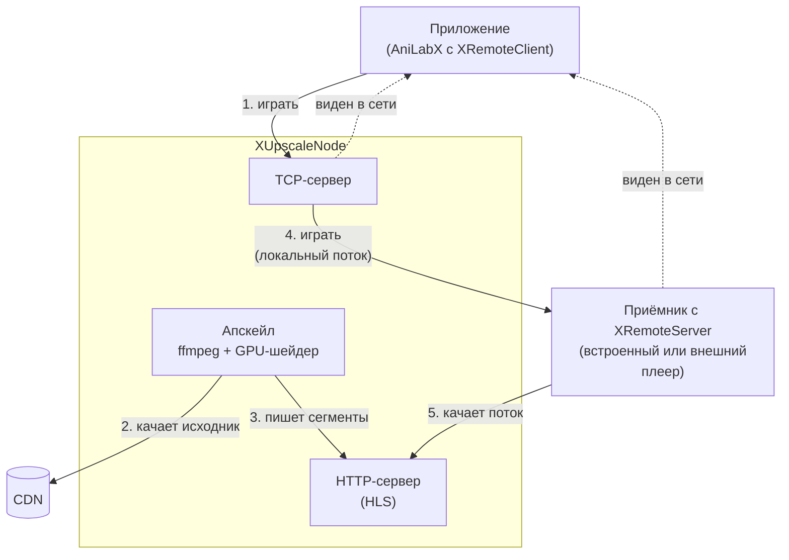
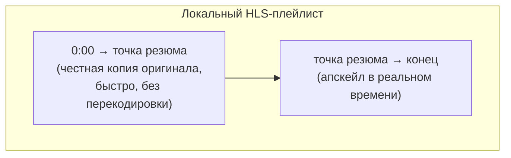

# XUpscaleNode

AI-апскейл прокси-узел для кастинга **AniLabX → XRemoteDesktop**.

Ставится на отдельный ПК с GPU между приложением-отправителем и реальным
приёмником. Перехватывает команду начала воспроизведения, прогоняет поток
через нейросетевой/шейдерный апскейлер в реальном времени и отдаёт
приёмнику уже улучшенную картинку вместо оригинала — при этом ни
отправитель, ни приёмник не модифицируются и не знают о подмене.

Обозначения, используемые ниже:
- **приложение** — AniLabX (Android-версия, с включённым XRemoteClient) —
  то, что кастует видео;
- **приёмник** — XRemoteDesktop (ПК/ТВ-приставка) или та же AniLabX на
  Android с включённым XRemoteServer — то, что реально проигрывает видео
  своим встроенным плеером.

## Зачем это нужно

Приложение кастует видео на приёмник поверх собственного протокола: оно
находит приёмник в локальной сети (mDNS) и посылает ему прямую ссылку на
исходный поток. Приёмник сам качает и проигрывает этот поток своим плеером
— никакой обработки на лету там нет. Если исходник низкого разрешения (720p
и ниже, что для многих озвучек аниме — норма), на большом экране это
выглядит соответствующе.

XUpscaleNode встраивается прозрачно: приложение вместо реального приёмника
выбирает второй пункт в списке целей, узел на лету апскейлит поток и уже
подсовывает приёмнику ссылку на локальный, улучшенный HLS-плейлист.

## Принцип работы

*Приложение* и *приёмник* — те же, что определены выше.

Узел не заменяет приёмник, а встаёт между приложением и ним:

1. **Обнаружение.** Узел поднимает собственный mDNS-анонс того же типа
   сервиса, что и настоящий XRemote.
2. **Перехват.** Приложение с XRemoteClient посылает узлу ту же команду, что
   отправило бы настоящему приёмнику c XRemoteServer — с прямой ссылкой на исходный HLS-поток
   и позицией, с которой продолжить просмотр.
3. **Апскейл.** Узел запускает `ffmpeg` с GPU-шейдером (libplacebo) —
   Anime4K для реставрации мягкого/старого видео или FSRCNNX для
   нейтрального апскейла чистого источника — и на лету пишет новый,
   улучшенный HLS-плейлист локально.
4. **Подмена и форвард.** Узел подменяет ссылку на
   оригинал ссылкой на свой локальный плейлист и пересылает её настоящему
   приёмнику. Дальше приёмник работает как обычно — просто скачивает
   HLS-поток не с CDN, а с узла, и проигрывает его своим плеером.
5. **Обратный проброс.** Всё остальное (пауза, громкость, перемотка,
   прогресс воспроизведения, закрытие плеера) узел прозрачно транслирует
   на приложение где развернут XRemoteServer, при необходимости
   поправляя позицию воспроизведения под правильный масштаб.

### Резюм с середины эпизода

Если пользователь открывает серию не с начала, наивный подход (запустить
апскейл сразу с нужной позиции) ломает прогресс-бар и историю просмотра на
самом приёмнике — тот не видит начала файла и путает отсчёт времени. Вместо
этого узел сначала быстро копирует кусок оригинала от 0 до точки резюма, и уже на нём наращивает апскейленный хвост:

Для приёмника это выглядит как один непрерывный файл с правильными
метками времени на нужную позицию отрабатывает штатно,
прогресс и история просмотра не ломаются.

Обратная сторона: при выборе продолжить серию не с начала после запуска
придётся подождать — от одной до трёх минут, в зависимости от того, как
далеко в файле стоит отметка последнего просмотра, — именно столько
занимает копирование куска оригинала перед тем, как воспроизведение
реально начнётся.

### Два режима апскейла

| Режим | Движок | Философия | Лучше для |
|---|---|---|---|
| `performance` | Anime4K | «Сделай так, чтобы выглядело как 4K» — агрессивная реставрация + резкость | 720p и старое/мягкое по деталям аниме |
| `fidelity` | FSRCNNX | «Покажи ровно, что нарисовал художник» — нейтральный апскейл, сохраняет текстуру, линии, зерно плёнки | Чистый современный 1080p-источник |

По умолчанию режим `auto` — узел сам определяет, что использовать, по
разрешению источника (ниже 1080p → `performance`, 1080p и выше →
`fidelity`), один раз при старте сессии.

## Установка

Нужен ПК с GPU (NVIDIA/AMD/Intel с рабочими драйверами и Vulkan-рантайм) в
той же локальной сети, что и приложение, и настоящий приёмник.

Готовая сборка (`XUpscaleNode.exe` + всё необходимое, включая ffmpeg и
шейдеры — распаковать и запустить, Python не нужен) — на странице
[Releases](../../releases). Собирать из исходников (см. ниже) нужно только
если требуется что-то поменять в коде.

1. Скачать и распаковать архив со страницы Releases.
2. Запустить `XUpscaleNode.exe` (или `start.bat`) — откроется окно
   настроек.
3. В настройках самого XUpscaleNode указать адрес и порт настоящего
   приёмника — XRemoteDesktop (ПК/ТВ-приставка) или та же AniLabX на
   Android с включённым XRemoteServer, при необходимости поправить
   остальные параметры, нажать кнопку запуска.
4. В настройках приложения AniLabX (раздел XRemote) указать IP-адрес и
   порт, на которых слушает сам XUpscaleNode — приложение должно
   обращаться к узлу, а не напрямую к приёмнику.

Готовую папку после этого можно копировать на другие ПК как есть —
`node_ip` при каждом запуске определяется автоматически.

### Сборка из исходников

1. Скачать и распаковать в `tools/ffmpeg/` сборку
   [BtbN/FFmpeg-Builds](https://github.com/BtbN/FFmpeg-Builds/releases)
   (нужна `-gpl` сборка — в ней есть и `libplacebo`, и GPU-энкодеры;
   `ffmpeg.exe`/`ffprobe.exe` должны лежать в `tools/ffmpeg/bin/`).
2. Запустить `build.bat` — он поставит Python-зависимости во временный
   `.venv` (Python 3.11+ должен быть в `PATH`) и соберёт `XUpscaleNode.exe`
   в корне проекта.
3. Дальше — как и с готовой сборкой, начиная с шага 2 выше.

### Продакшн (без окна, автозапуск)

Для постоянной работы в фоне — `run_node.bat`, который держит узел в
режиме `--headless` (без окна) в цикле с автоперезапуском при падении, и
пишет лог в `start_debug.log`. Обычно вешается на Планировщик заданий
Windows, плюс отдельная задача-сторож (`watchdog.bat`), которая по таймеру
проверяет, что узел действительно слушает свой порт, и перезапускает
задачу, если нет.

Headless-режим и режим с окном не могут одновременно занимать одни и те же
сетевые порты на одной машине — для локальной проверки через окно сначала
останавливают фоновую задачу.

## Лучший способ применения

Удобнее всего, когда отправитель и приёмник — это одно и то же устройство:
на ТВ (Android TV/приставке) стоит AniLabX, и в её настройках включены
одновременно и XRemoteServer, и XRemoteClient. У них должны быть **разные
порты** — иначе один из сервисов не поднимется. Отдельный телефон в такой
схеме не нужен вообще:

1. В настройках XRemoteClient (на том же ТВ) указать адрес и порт
   XUpscaleNode.
2. В настройках самого XUpscaleNode — адрес и порт XRemoteServer этого же
   устройства.
3. При выборе способа воспроизведения серии выбрать вариант «через
   XRemote» (а не обычный встроенный плеер).

При правильной настройке откроется плеер и начнёт воспроизводить уже
апскейленный поток.

## Настройка

Все параметры (кроме редких — путей к `ffmpeg`/шейдерам, HTTP-порта,
таймаутов, которые правятся только в `config.yaml`) доступны прямо в окне
приложения и применяются сразу, без перезапуска:

- **Приёмник** — адрес и порт настоящего приёмника (XRemoteDesktop или
  AniLabX с включённым XRemoteServer).
- **Имя узла** — как он будет виден в списке целей для каста.
- **Режим апскейла** — авто / performance / fidelity.
- **Качество кодирования** и **лимит битрейта**.
- **Продолжение эпизода** — честно резюмировать с сохранённой позиции или
  всегда начинать сначала.
- **Автозапуск сервера** — поднимать апскейл сразу при открытии окна.

IP-адрес самой машины (`node_ip`) определяется автоматически при каждом
запуске сервера — вручную его прописывать не нужно ни при первой
установке, ни при переносе на другой ПК.

## Ограничения

- Перемотка (в том числе на уже сыгранный участок) перезапускает
  апскейл-пайплайн с новой позиции — короткая пауза/буферизация вместо
  мгновенного скачка, как у обычного локального плеера. Чем глубже в файл
  выполняется резюм/перемотка, тем дольше идёт первичная копия оригинала
  до точки старта.
- Узел держит только одну активную сессию воспроизведения одновременно —
  это прокси для одного зрителя, а не многопользовательский сервис.
- Требуется GPU, поддерживающий выбранный энкодер (`gpu_encoder` в
  настройках) и Vulkan — без GPU-ускорения апскейл в реальном времени не
  успевает за потоком.

## Из чего сделано

- **ffmpeg** со сборкой [BtbN](https://github.com/BtbN/FFmpeg-Builds) —
  единственная широко доступная сборка с одновременной поддержкой
  `libplacebo` (шейдерный апскейл) и GPU-энкодеров (`nvenc`/`amf`/`qsv`).
- **Шейдеры** Anime4K и FSRCNNX — из активно поддерживаемого набора
  [Chinna95P/mpv-anime-build](https://github.com/Chinna95P/mpv-anime-build).
- Обнаружение и протокол реализованы по образцу настоящих
  XRemoteDesktop/AniLabX — они не модифицируются и не требуют установки на
  узел.
